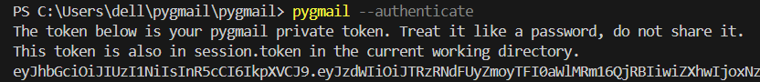

# pygmail
Python Gmail client to send emails fast and easy  
Installation through `pip install pygmail`  
  
## how to use
### first run
you first install using `pip install pygmail`,  
then you run `pygmail --authenticate`, you choose the email from which you wish to send emails.  
pygmail will ask to be able to send emails on your behalf.  



once that's complete, a private token will be printed in your terminal and also a session.token file  
will be created in the current working directory containing your token  

### sending emails
first import GmailClient from pygmail.
```py
from pygmail import GmailClient
```
then, create an instance of GmailClient.
```py
client = GmailClient()
```
then, initialize it, either pass the session token directly, or have the session.token file in the same directory as the python file.
```py
client.init("SESSION_TOKEN")

or

client.init()
```
now finally, send the email.
```py
client.send_email("recipient@gmail.com", "Subject", "Body")
```
here's it all in action:
```py
from pygmail import GmailClient

client = GmailClient()
client.init("eyJhbGciOiJAfnduiIsInR5cCI6IkpXVCJ9.eyYFNaHOiJTRzRNdFUyZmoyTFI0aWlMRm16QjRBIiwiZXhwIjoxNzU4MTEwMTk5fQ.epxB85tX99gfUYx_Ji9uHtLWTFnyumfKEFyYnw0kyE")

client.send_email("recipient@gmail.com", "Subject", "Body")
```

you can get the message id of the email as `send_email` returns the message:
```py
resp = client.send_email("something", "cool subject", "even cooler message")
print(resp)
```
output:
```
{'message_id': '19952cb0365d9fd8'}
```
